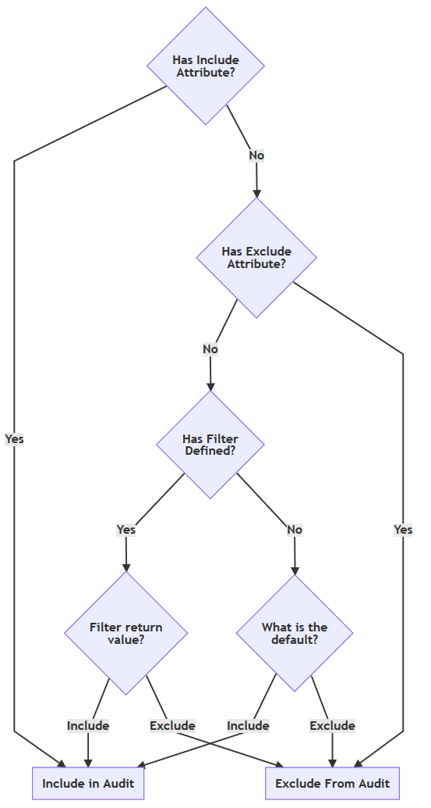
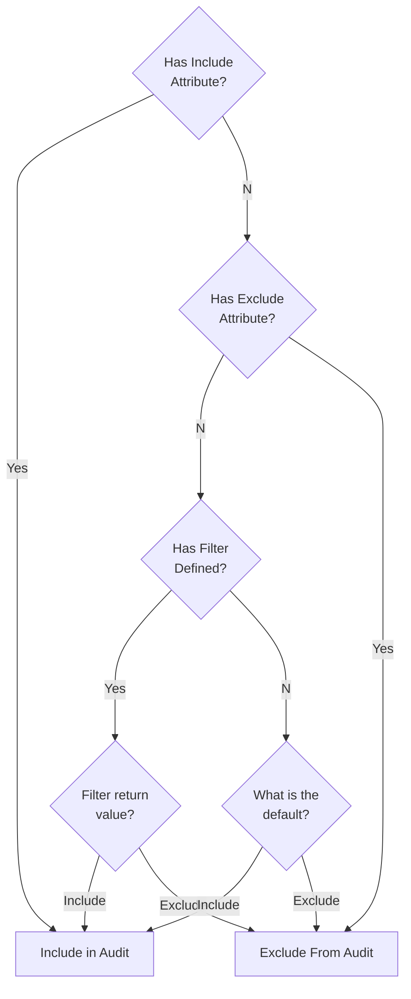

 Add message auditing filtering functionality to [NServiceBus](https://docs.particular.net/nservicebus/operations/auditing).

<!--- StartOpenCollectiveBackers -->

[Already a Patron? skip past this section](#endofbacking)

## Community backed

**It is expected that all developers [become a Patron](https://opencollective.com/nservicebusextensions/order/6976) to use any of these libraries. [Go to licensing FAQ](https://github.com/NServiceBusExtensions/Home/blob/master/readme.md#licensingpatron-faq)**

### Sponsors

Support this project by [becoming a Sponsors](https://opencollective.com/nservicebusextensions/order/6972). The company avatar will show up here with a link to your website. The avatar will also be added to all GitHub repositories under this organization.

### Patrons

Thanks to all the backing developers! Support this project by [becoming a patron](https://opencollective.com/nservicebusextensions/order/6976).

<!--- EndOpenCollectiveBackers -->

## NuGet package

https://nuget.org/packages/NServiceBus.AuditFilter/ 

## Usage

### Decorate messages with attributes

snippet: MessageToIncludeAudit

snippet: MessageToExcludeFromAudit

### Add to EndpointConfiguration

With include by default

snippet: DefaultIncludeInAudit

With exclude by default

snippet: DefaultExcludeFromAudit

### Delegate filter fallback

The fallback/default value can also be controlled by a delegate.

snippet: FilterAuditByDelegate

## Include/Exclude logic flow

<!--

-->

## Sample

The sample uses the [Learning Transport](https://docs.particular.net/transports/learning/) and the resultant messages can be viewed in the [Storage Directory](https://docs.particular.net/transports/learning/#usage-storage-directory).

### Decorate messages with attributes

snippet: MessageToExcludeFromAudit

snippet: MessageToIncludeAudit

### Add to EndpointConfiguration

snippet: Enable

## Icon

[Audit](https://thenounproject.com/term/audit/618766/) designed by [Delwar Hossain](https://thenounproject.com/delwar/) from [The Noun Project](https://thenounproject.com/).