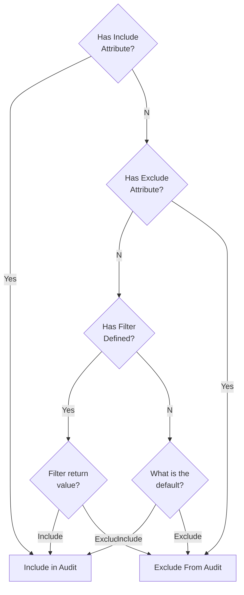

```mermaid

graph TD

HasExcludeAttribute{Has Exclude<br />Attribute?}
HasIncludeAttribute{Has Include<br />Attribute?}

Include[Include in Audit]
Exclude[Exclude From Audit]
Default{What is the<br /> default?}

HasFilter{Has Filter<br />Defined?}
WhatFilter{Filter return<br /> value?}

HasIncludeAttribute --Yes--> Include
HasIncludeAttribute --No--> HasExcludeAttribute
HasExcludeAttribute --No--> HasFilter
HasExcludeAttribute --Yes--> Exclude
HasFilter--Yes--> WhatFilter
WhatFilter--Include--> Include
WhatFilter--Exclude--> Exclude
HasFilter--No--> Default
Default--Include--> Include
Default--Exclude--> Exclude

```
-->
